# flexible-approval


An open-source digital workplace platform were you can define and run you approval workflows. Build on [Next.js](https://nextjs.org/) with [Typescript](https://www.typescriptlang.org/) and [Postgres]()

## Disclamer

At this stage, this project is for educational purposes only. It is not intendet to be used as a real world application in productive environments yet.

## Introduction

flexible-approval can be understood as a proof of concept of a no-code Integration platform as a service (iPaaS). It allowes you to manage your approval workflows from this single platform.

Examples for approval processes are:

- Order processing
- Accounts payable - E.g. approval of incoming invoices
- Return and refund management
- Employee onboarding
- Holiday requests

## Features

### Flow definition and control

You visually create and execute your workflows. No coding skills needed.

### Filtering

Control the execution of workflow nodes with conditional statements.

### Execution history

Analyze every step of a workflow execution. Also to proof certain quality standards.

### Error handling

Get automatically notified in case of an error (comming soon!)

## Scenarios and Nodes

In order to automate your approval process, you have to create a scenario. A scenario consits of a series of connected Nodes that indicate how the context data is processed.

Currently there are five types of Nodes:

### 1. START

It indicates the starting point of the workflow

### 2. ACTION

An approver is asked to act; either to approve or to reject

### 3. COND

Using decision based logic to implement filter logic

### 4. EVENT

The applicant can be notified with information concerning the ongoing workflow

### 5. TER

Indicates the workflow to terminate.

For every Node, you need to configure its settings. For Example a Event Node requires you to specify a description, a receiver and a Text Template.

## Create an Scenario

To create a scenario got to **Scenarios** and select **Create a new scenario**

You always begin a Scenario with a START node. Enter the description of your Scenario in the corresponding form field.

### Context Data Description

The Context Data Description basically describes the data you want to approve. It has to be in JSON format. In case of the Holiday approval wokflow example, this could look like the following definition:

```
{
 "requestorEmail":"string",
 "startDate":"string",
 "endDate":"string",
 "duration":"Number"
}
```

- `requestoEmail` Email address of the person who makes the request
- `startDate`, `endDate` Dates, when they want to go on holiday
- `duration` days off in total

### Create a START node

<figure>
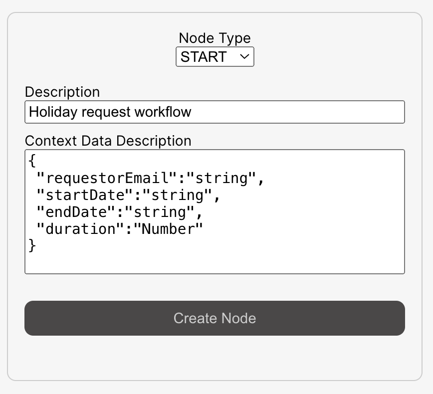
  <figcaption>Create and configure the START node with the Context Data Description </figcaption>
</figure>

### Create an ACTION node

<figure>
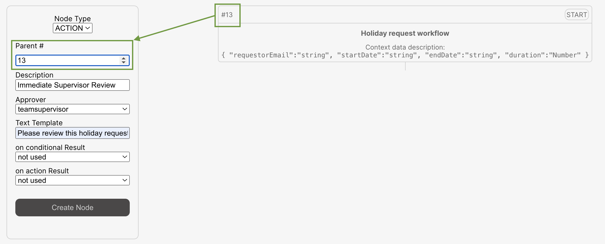
  <figcaption>Except from the START node, every node has to be associated with one parent. In this case, we want the ACTION node to be associated with the START node, therefor we will have to enter its node number in the configuration. In this example: 13. </figcaption>
</figure>

### Create an EVENT node

<figure>
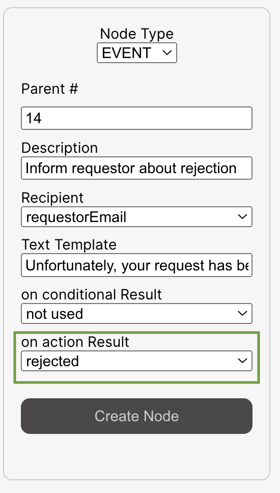
  <figcaption>An EVENT is basically a notification sent to the Applicant, with information concerning the ongoing workflow. In this exapmle, we want the EVENT to get executed, when the previous ACTION is rejected. Therefore we have to set 'on action Result' as 'rejected'. </figcaption>
</figure>

### Create a COND node

<figure>
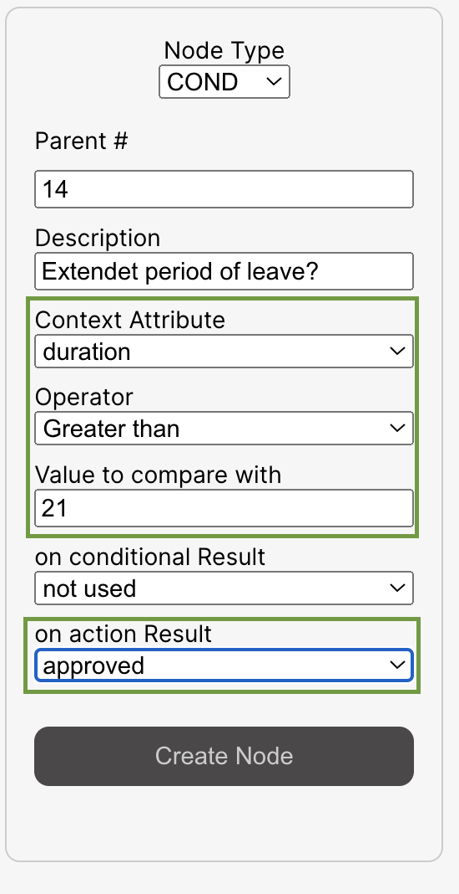
  <figcaption>The COND node implements a filter function. In this example we want to distigunish if the requested time of leave is more than 21 day. If so, an additional approvement by the head of department is neccessary. Otherwise the request will be accepted an the Applicant gets informed.</figcaption>
</figure>

### Create a TER node

<figure>
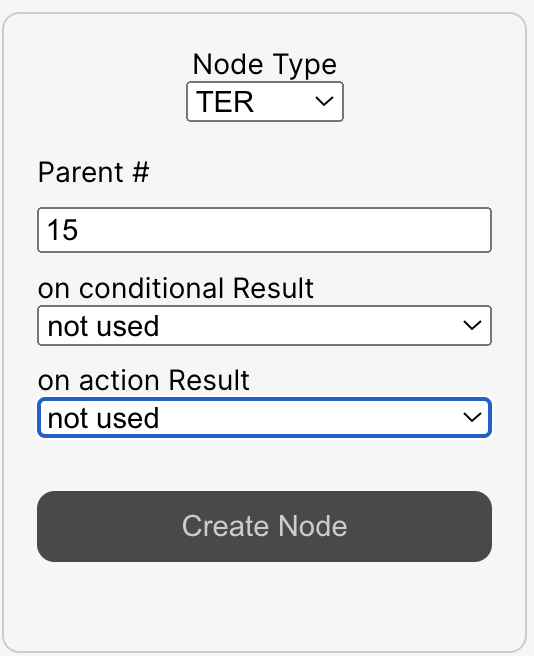
  <figcaption>A TER node identifies the end of an execution branch to let the processing engine know, when to finisch processing.</figcaption>
</figure>

## Running a scenario

Once the scenario is completly defined, it is ready to get used.
There are two options for how the START node can be triggered:

1. **Via External service**
   Initiate your workflow by making a POST request to a dedicated endpoint from any external web service, including the scenarioId and context data. However, please note that this feature is currently unavailable due to authentication issues that are yet to be resolved.

2. **Via Testrunner** from the flexible-approval platfrom:
You can access the Testrunner directly from the scenario diagramm.
<figure>
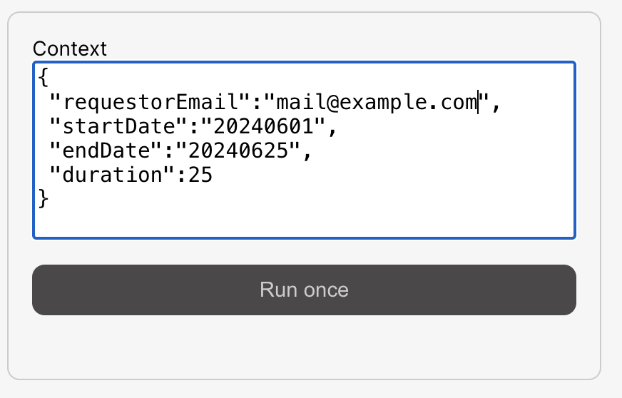
  <figcaption>You need to provide the concrete context information to the testrunner. The format has to match the Context Data Description as set in the START node definition! </figcaption>
</figure>

Once the scenario is started, you will immediately see a graphical visualization of the current state.

<figure>
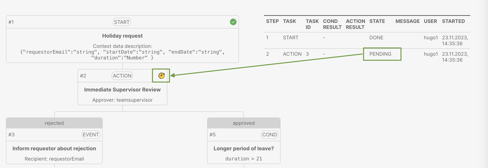
  <figcaption>The START node has been triggerd. The following ACTION node is waiting for the teamsupervisor response. The workflow is on-hold at this stage.</figcaption>
</figure>

### Responding to ACTIONs

The Approver, as configured in the ACTION definition - receives an Email with an Link to respond, either **reject** or **approve**

<figure>
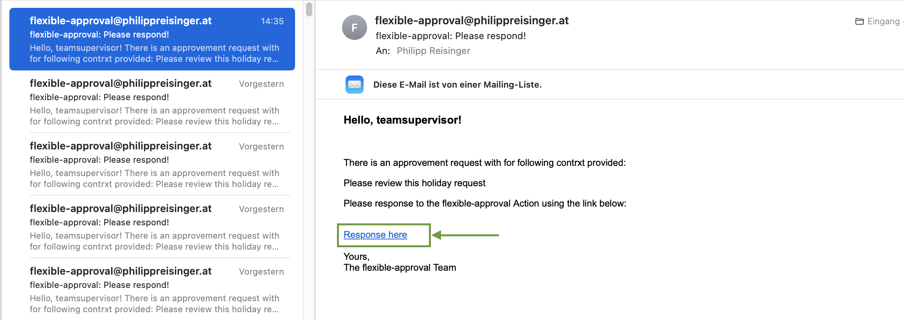
  <figcaption>The Link will lead to dedicated response page</figcaption>
</figure>

<figure>
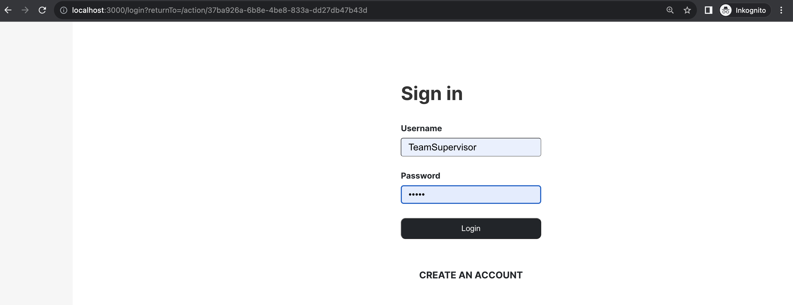
  <figcaption>The approver needs to authenitcate</figcaption>
</figure>

<figure>
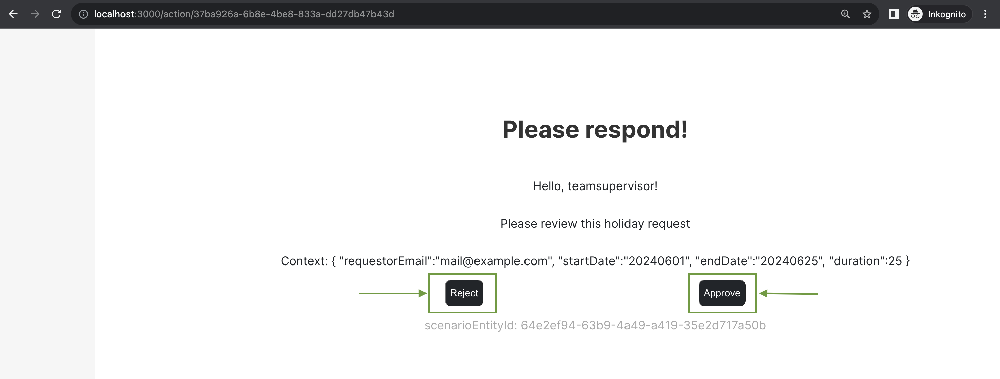
  <figcaption>The approver is asked to approve or reject</figcaption>
</figure>

<figure>
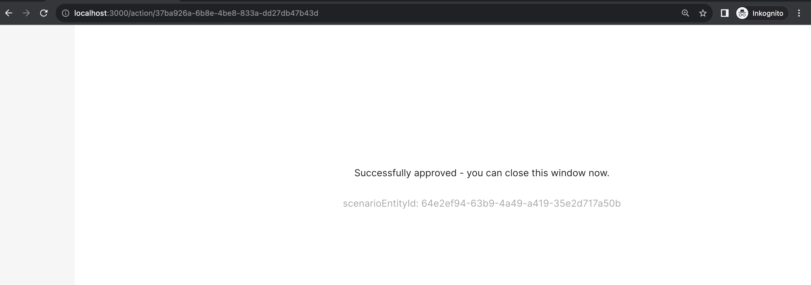
  <figcaption>Once the Approver has responded, the link gets invalidated</figcaption>
</figure>

### Analyzing process steps

<figure>
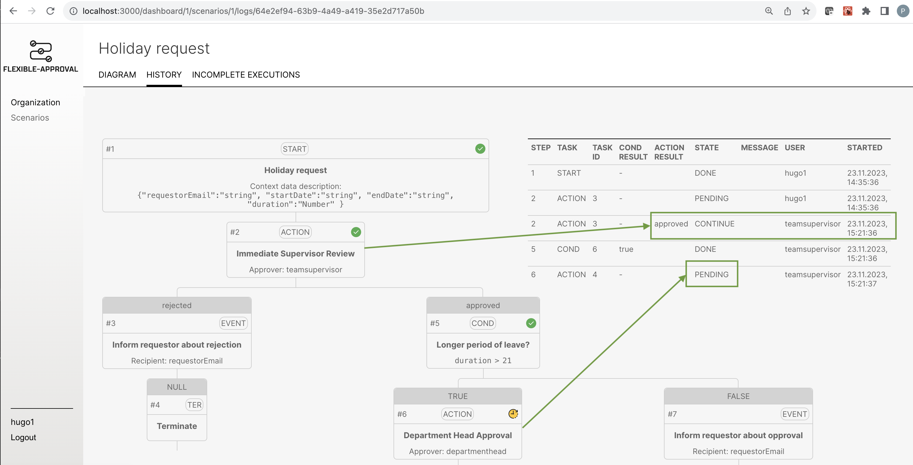
  <figcaption>
Once the initial ACTION has received approval, the subsequent COND evaluates to true, indicating a leave period exceeding 21 days. We are currently awaiting a response from the Department Head. The timestamps on the right can be utilized to assess the workflow's efficiency.  </figcaption>
</figure>

<figure>
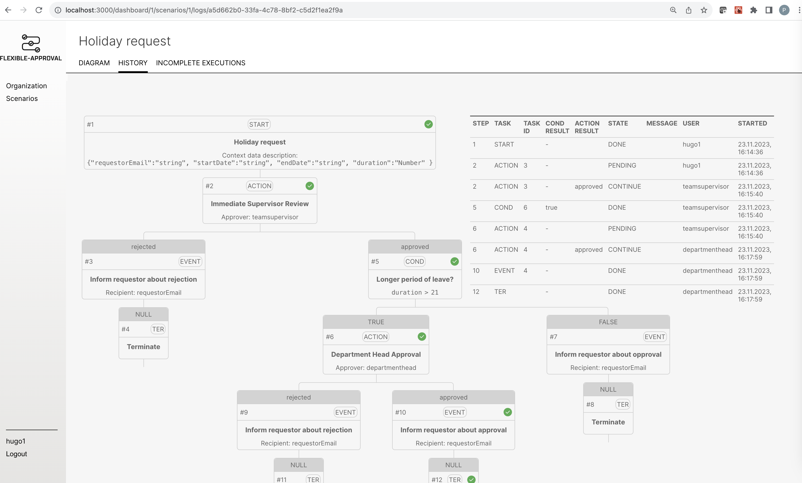
  <figcaption>After the second ACTION has been approved (by the department head). The EVENT has executed which triggerd an Email sent to the Applicant. The Workflow has endet at this stage.</figcaption>
</figure>

<figure>
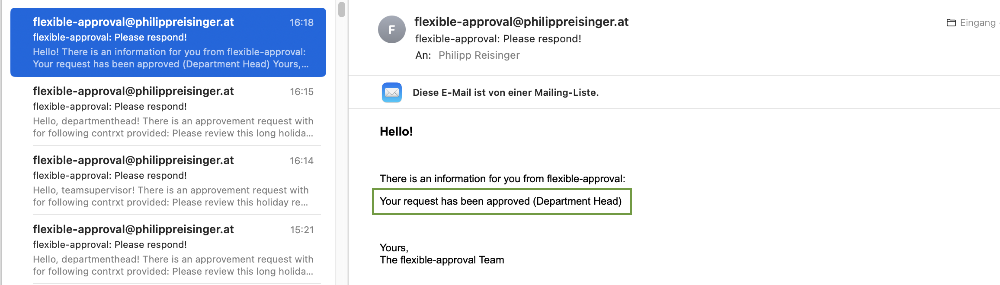>
  <figcaption>Ultimately, the applicant receives notification confirming the successful approval of their holiday request. 🙂</figcaption>
</figure>

### Execution history

<figure>
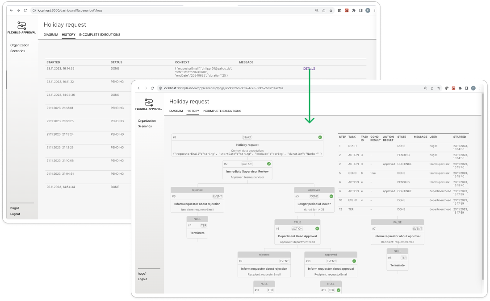
  <figcaption>You can view the comprehensive logs of previous executions by accessing the Scenario History Tab.</figcaption>
</figure>

## Development

The following instructions are for those who want to develop the flexible-approval framework.

1.  ### Clone this repo to you local machine and install dependencies

    ```git clone https://github.com/phreis/flexible-approval
    cd flexible-approval
    pnpm install
    ```

2.  ### Install postgres and set up the database

    2.1 Install postgres, in case you haven't already.

    ```
    brew install postgresql@15
    brew link postgresql@15
    ```

    Set an environment variable to tell PostgreSQL where to put the data:

    ```
    [[ -d /opt/homebrew/var/postgresql@15 ]] && PGDATA_TMP=/opt/homebrew/var/postgresql@15 || PGDATA_TMP=/usr/local/var/postgresql@15
    echo "\nexport PGDATA=$PGDATA_TMP\nexport LC_ALL=en_US.UTF-8" >> ~/`[[ $SHELL == *"zsh" ]] && echo '.zshrc' || echo '.bash_profile'`
    source ~/`[[ $SHELL == *"zsh" ]] && echo '.zshrc' || echo '.bash_profile'`
    ```

    Verify if PostgreSQL has been correctly installed

    ```
    postgres

    ```

    You should get some output to console containing `database system is ready to accept connections`

    #### 2.2 Setup the database for this project

    - Copy the `.env.example` file to a new file called `.env` (ignored from Git) and fill in the necessary information. Choos a databasename, username and passwort. In out testcase it is recommend to use the same string for all variables. E.g. something like this:

      ```
      PGHOST=localhost
      PGUSERNAME=my_felxible_approval
      PGPASSWORD=my_felxible_approval
      PGDATABASE=my_felxible_approval


      MJAPIKEYPUBLIC=<your https://www.mailjet.com/ public key>
      MJAPIKEYPRIVATE=<your https://www.mailjet.com/ private key>

      ```

    - `psql postgres`
    - Enter in the repl:

      ```
       CREATE DATABASE <database name>;
       CREATE USER <user name> WITH ENCRYPTED PASSWORD '<user password>';
       GRANT ALL PRIVILEGES ON DATABASE <database name> TO <user name>;
       \connect <database name>;
       CREATE SCHEMA <user name> AUTHORIZATION <user name>;
      ```

      `quit` to leave the prsql repl.

    #### 2.3 Run the migrations

    - Create the database tables and inserts some entries
      The following command processes the files in `./migrations` in a sequential order. Whe need to use the option `-r tsm`, as our migration files are Type Script.

      ```
      ley up -r tsm
      ```

      Hint: To undo/initialize the migrations e.g. delete entries and tables we could use:

      ```
      ley down -a -r tsm
      ```

## Run the development server:

```bash
npm run dev
# or
yarn dev
# or
pnpm dev
# or
bun dev
```

Open [http://localhost:3000](http://localhost:3000) with your browser to see the result.

## Deploy on Fly.io

1. Install flyctl
   flyctl is a command-line utility that lets you work with Fly.io

   ```
   brew install flyctl
   ```

2. Sign up on Fly.io and verify your email
3. On the Fly.io dashboard page, click on the Add a payment method link at the top right of the page and follow the instructions (you will not be charged)
4. On the Fly.io Tokens page, generate a new Fly.io access token named GitHub Actions Deploy Token and copy it from the text box that appears - it will only be shown once
5. In your GitHub repo under Settings → Secrets → Actions, click the New repository secret button at the top right of the page and create a new token with
   the name FLY_API_TOKEN and the token you copied as the secret
6. On the command line, open the Fly.io login page in your browser using the following command:
   `flyctl auth login`
7. Enter your credentials in the browser window that appears and then click on the link Try Fly.io for free.
8. Switch back to the terminal - it should now show a message like successfully logged in as <your email>.
9. Create an app, specifying the name using only lowercase letters and dashes:
   flyctl apps create --name <app name> --machines
10. Create the Fly.io config files as demonstrated in the lecture (also available in the Next.js example repo)
    - .dockerignore
    - .env.production
    - .github/workflows/test-playwright-and-deploy-to-fly-io.yml
    - Dockerfile
    - database/connect.ts
    - fly.toml (in fly.toml adjust app name!)
    - next.config.js
    - playwright/navigation.spec.ts
    - scripts/fly-io-start.sh
    - util/config.mjs
11. Change your ley.config.mjs: add ssl config for Vercel
12. Change your util/config.mjs: exit early in production, alias Vercel database environment variables
13. Change your next.config.js: disable linting and type checking on build, since this happens earlier in the GitHub Actions deploy workflow
14. Add database credentials using Fly.io secrets, randomly generating the database name, username and password:

    ```
    flyctl secrets set PGHOST=localhost PGDATABASE=upleveled$(openssl rand -hex 16) PGUSERNAME=upleveled$(openssl rand -hex 16) PGPASSWORD=$(openssl rand -base64 32)
    ```

    If your app needs any additional environment variables such as API keys, also add them to the secrets using the following pattern:
    flyctl secrets set <secret name>=<secret value>
    The Next.js documentation mentions exposing variables to the browser using variables prefixed with NEXT*PUBLIC*. Instead of using environment variables for this, we recommend declaring a JavaScript variable in your code because this information is not secret - it will be exposed to the browser. If you absolutely need to set a NEXT*PUBLIC* environment variable, you can add it to your .env.production file.

15. Create a 1GB volume for the PostgreSQL database in the Bucharest region (slower region IDs: Amsterdam ams or Warsaw waw):

    ```
    flyctl volumes create postgres --size 1 --region otp
    ```

16. Deploy the first version of the app:

    ```
    flyctl deploy
    ```

You may receive a failed to fetch an image or build from source error during deployment:
Error failed to fetch an image or build from source: error building: executor failed running [/bin/sh -c yarn build]: exit code: 1
Deploys may fail for a number of reasons, to find the real error message you will need to scroll up in the logs and find the first line that looks like an error.

## License

MIT
